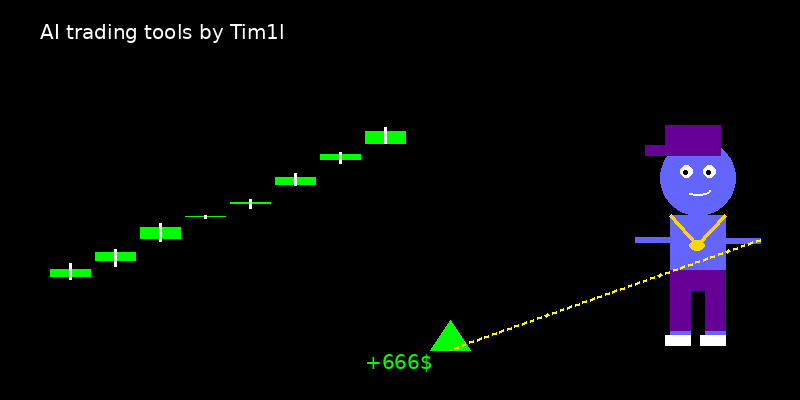

<!-- Waving Hand GIF for dynamic intro -->
 

# 👋 Tim Izmailov – Quant Data Scientist & CTO @ FlirtAGPT

Passionate data scientist with a nuclear physics background, transitioned into building cutting-edge AI-driven trading systems and generative AI solutions. Developed a high-performance RL trading agent (EV >0.72), a BTC trend predictor (68% accuracy in the trend prediction), and over 500 PineScript strategies, alongside managed portfolio with 25-30% annual returns in last 3 years. Ready to deliver scalable, high-impact AI solutions for quant funds and innovative projects. 🚀

   

## 🚀 Featured Projects
Star/fork these – sponsors get exclusive models & updates. Hire me on Upwork for custom versions!

<b>RL Trading Agent for BTCUSDT (EV >0.72)</b> – High-Performance Reinforcement Learning

**Overview**  
Developed a sophisticated PPO-based reinforcement learning agent for BTC/USD trading on a 15-minute timeframe, leveraging a custom Gym environment with a proprietary reward function. Integrates 80+ high-signal entry points (TP(ATR)=SL(ATR), win rate >60% in backtests) derived from multi-timeframe market patterns (M15, H1, H4, D1).

**Key Features**  
- **Advanced Architecture**: Utilizes a TCN feature extractor (64-256 channels, dilations [1,2,4,8], kernel=10) with action masking for trade compliance.  
- **Performance**: Achieves robust profitability from epoch 1 (32% profit at 10% drawdown in bullish phases).  
- **Scalability**: Optimized for any crypto exchange or MT5 broker without slippage for large enough portfolio.  

**Tech Stack**  
- Python, PyTorch, Stable-Baselines3  
- Custom TCN, Pandas, NumPy, TA-Lib
- Bybit/MT5 APIs for real-time execution  

**Links**  
- *Repo*: [RL BTC Trading Agent](https://github.com/Tim1l/rl-btc-trading-agent)  
- *Monetization*: Contact me to customize this agent for your fund’s trading strategy.  

<b>BTC Trend Predictor (68% Accuracy, 0.67 F-Score)</b> – Real-Time Multi-Timeframe Forecasts

**Overview**  
Built a hybrid TCN-LSTM model with MultiHead Attention for predicting the next candle’s direction across 4h, 1d, and 1w timeframes. Achieves 67-68% accuracy and 0.67 F-score on out-of-sample data, surpassing random baselines by 16-18%, with streaks of 95+ correct predictions.

**Key Features**  
- **Robust Predictions**: Processes high-frequency OHLCV data via CCXT, computing 20 technical indicators (RSI, MACD, Bollinger Bands).  
- **Data Pipeline**: Applies log1p and tanh normalization with rigorous NaN/gap detection and forward-filling for stability.  
- **Deployment**: Runs 24/7, delivering consistent real-time forecasts for multi-timeframe trading.  

**Tech Stack**  
- Python, TensorFlow, Keras-TCN  
- Pandas, TA-Lib, CCXT  

**Links**  
- *Repo*: [Crypto BTC Trend Prediction](https://github.com/Tim1l/crypto_btc_trend_prediction) (currently private)  
- *Engage*: Follow my [X profile](https://x.com/tim13l) for live prediction updates or sponsor for access to the full dataset.  

<b>PineScript Strategies (500+ Scripts)</b> – Multi-Timeframe TradingView Systems

**Overview**  
Crafted 500+ PineScript v6 strategies for TradingView, focusing on multi-timeframe analysis (M15, H1, H4, D1) and market phase decomposition. Includes 80+ core strategies with win rates of 55-75% and sharpe ratio of 1.3-1.8.

**Key Features**  
- **Robust Design**: Utilizes RSI, Bollinger Bands, EMA, HMA, and ATR without curve-fitting for market adaptability.  
- **Multi-Timeframe**: Combines M15 signals with H1/H4/D1 context for high-signal entries.  
- **Customization**: Ready to enhance any trading system with tailored, high-performance strategies.  

**Tech Stack**  
- PineScript v6  

**Links**  
- *Repo*: [PineScript Strategies](https://github.com/Tim1l/PineCryptoStrategies)  
- *Monetization*: Hire me on [Upwork](https://www.upwork.com/services/product/development-it-custom-pine-script-trading-strategy-automated-adjusted-for-profitability-1888093205491441659?ref=project_share) to develop or optimize your trading strategies.  

<b>Trading Bots Portfolio (50+ Scripts)</b> – Crypto Futures

**Overview**  
Designed and deployed 50+ trading bots for BTCUSDT futures, achieving 20-25% annual returns with 10% drawdown while managing a $330K portfolio. Focused on diverse, rigorously backtested trading strategies.

**Key Features**  
- **Performance**: Delivered consistent returns through automated systems optimized for crypto futures.  
- **Backtesting**: Employed rigorous testing to ensure strategy robustness across market conditions.  
- **Experience**: Demonstrates deep expertise in building and managing high-stakes trading systems.  

**Tech Stack**  
- TSLab, Backtrader  

**Details**  
- Showcases my experience in developing and managing automated trading systems for crypto futures.  

## 🛠️ Skills Stack
A comprehensive set of technical and interpersonal skills honed through advanced AI-driven trading systems, data engineering, and generative AI projects, underpinned by a nuclear physics background that drives analytical precision and problem-solving.

| Category          | Tools & Expertise                                                                 |
|-------------------|----------------------------------------------------------------------------------|
| **AI/ML**         | - **Frameworks**: Proficient in PyTorch, TensorFlow, Keras and Stable-Baselines3 for building and optimizing neural networks and reinforcement learning models.   - **Architectures**: Expertise in designing hybrid TCN-LSTM-CNN models with MultiHead Attention and custom feature extractors for time-series prediction.   - **Reinforcement Learning**: Advanced PPO implementation with action masking, custom reward shaping, and gradient hooks for stability.   - **Model Optimization**: Skilled in dataset preparation, hyperparameter tuning, layer normalization, and optimization to mitigate overfitting and ensure robust performance.   - **Predictive Modeling**: Developed models achieving high accuracy and F-scores for financial forecasting. |
| **Trading Systems** | - **Strategy Development**: Expert in crafting robust trading strategies using python, PineScript or TSLAB, with multi-timeframe analysis (M15, H1, H4, D1) and market phase decomposition.   - **Automation**: Proficient in Pinescript, TSLab and Backtrader for building automated trading bots, with rigorous backtesting for performance validation.   - **API Integration**: Seamless integration with any crypto exchange and MT5 APIs for low-latency execution and real-time market data processing.   - **Risk Management**: Skilled in designing systems with dynamic TP/SL and low drawdown strategies for high-stakes environments.   - **Market Analysis**: Deep understanding of market phases, technical indicators and multi-timeframe analysis. |
| **Data Engineering** | - **Data Processing**: Advanced proficiency in Pandas, NumPy and Matplotlib for handling high-frequency financial datasets.   - **Feature Engineering**: Expertise in computing technical indicators using TA-Lib and implementing robust normalization.   - **Time-Series**: Skilled in multi-timeframe data preprocessing, imputation, and quality checks for stable model inputs.   - **Data Pipelines**: Built scalable pipelines for real-time OHLCV data fetching and processing across  **Performance Optimization**: Optimized data workflows for high-throughput environments, achieving high FPS on GPUs across parallel environments. |
| **Generative AI** | - **Leadership**: CTO at FlirtAGPT, driving the development of innovative AI products for conversational and creative applications.   - **Model Design**: Experienced in building and deploying generative AI models, leveraging deep learning frameworks for scalable solutions.   - **Product Development**: Skilled in end-to-end AI product lifecycle, from ideation to production deployment, with a focus on user-centric outcomes.   - **Innovation**: Applied cross-disciplinary insights from trading and physics to create novel generative AI use cases. |
| **Soft Skills**    | - **Analytical Thinking**: Leveraged nuclear physics background to tackle complex problems with precision and rigor.   - **Problem-Solving**: Developed innovative solutions for trading and AI challenges, balancing performance and scalability.   - **Communication**: Effectively translate technical concepts to stakeholders, as demonstrated in client engagements on Upwork and X posts.   - **Adaptability**: Successfully transitioned from nuclear physics to data science, mastering diverse tech stacks and domains.   - **Collaboration**: Open to partnerships with quant funds and startups, with a track record of delivering tailored solutions. |

## 📊 GitHub Stats & Timeline
  
  
  

**Timeline**:  
- 2023: Launched BTC Predictor (68% acc)  
- 2024: RL Agent hits EV 0.72, real-time deploy  
- 2025: >500 PineScript updates, seeking quant roles  

## 🤝 Connect & Monetize
- **Quant Funds**: Let's build AI trading systems. DM on LinkedIn/X.  
- **Hire Me**: Custom RL/predictors/strategies – [Upwork](https://www.upwork.com/freelancers/~01d554f7011bd884f2).  
- **Sponsor**: Early access to models/code – [Sponsor Now](https://github.com/sponsors/Tim1l).  
- **Contact**: tim@example.com | Telegram: @tim13l | Open for generative AI collabs @ FlirtAGPT.  

Star repos if helpful – more AI trading drops soon! 🚀  
 
<!--
**Tim1l/Tim1l** is a ✨ _special_ ✨ repository because its `README.md` (this file) appears on your GitHub profile.

Here are some ideas to get you started:

- 🔭 I’m currently working on ...
- 🌱 I’m currently learning ...
- 👯 I’m looking to collaborate on ...
- 🤔 I’m looking for help with ...
- 💬 Ask me about ...
- 📫 How to reach me: ...
- 😄 Pronouns: ...
- ⚡ Fun fact: ...
-->
